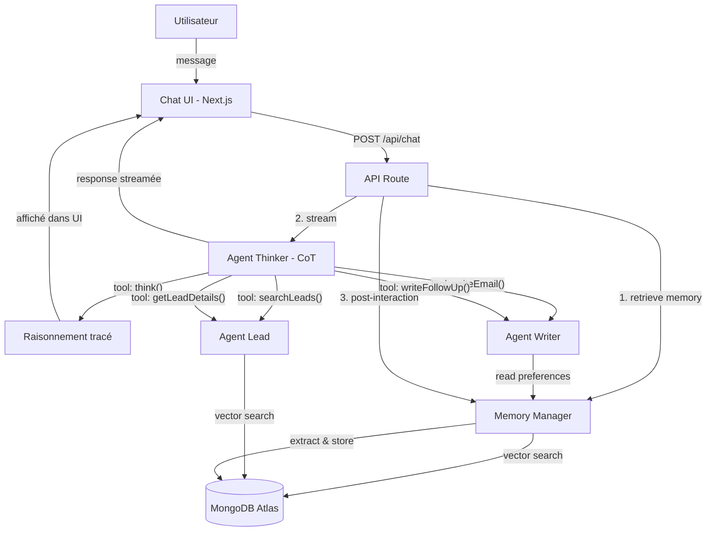
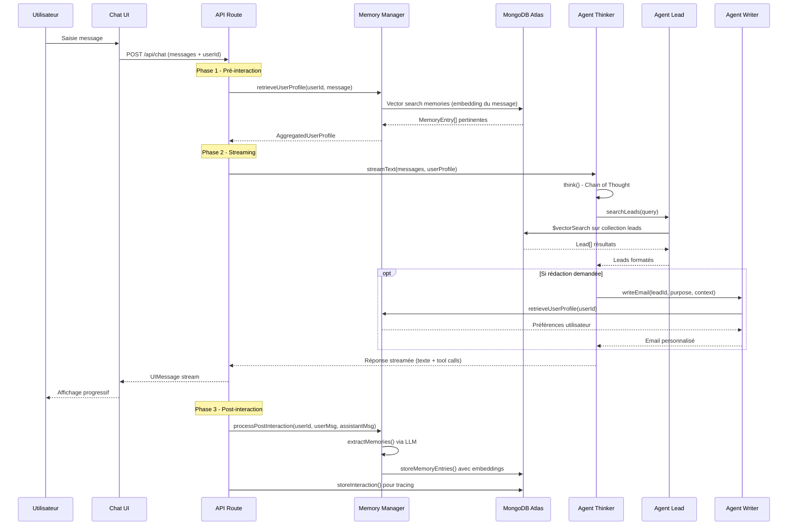

# Architecture Technique - Agentique AI

Documentation technique détaillée du système multi-agent : flux de données, décisions d'architecture, schémas de données et détails d'implémentation.

## Vue d'ensemble du système



## Flux d'une requête



## Agent Thinker - Chain of Thought

### Principe

Le Thinker est l'orchestrateur central. Il ne répond jamais directement : il raisonne d'abord via l'outil `think()`, puis route vers les agents spécialisés.

### Outils disponibles

| Outil | Agent cible | Description |
|-------|-------------|-------------|
| `think` | _(interne)_ | Raisonnement explicite. Produit un `reasoning`, un `plan` d'actions ordonnées, et identifie les `missingInfo`. |
| `searchLeads` | Lead Agent | Recherche sémantique dans la base de leads. Accepte des requêtes en langage naturel. |
| `getLeadDetails` | Lead Agent | Récupère le profil complet d'un lead par son ObjectId. |
| `writeEmail` | Writer Agent | Génère un email personnalisé (premier contact, proposition, remerciement, etc.). |
| `writeFollowUp` | Writer Agent | Génère une relance adaptée au temps écoulé depuis le dernier contact. |

### Flux de raisonnement

```
Requête utilisateur
    │
    ▼
┌─────────────────────────────┐
│  think()                    │
│  - Analyse l'intention      │
│  - Identifie les données    │
│    manquantes               │
│  - Planifie les actions     │
└─────────────┬───────────────┘
              │
    ┌─────────┼─────────┐
    ▼         ▼         ▼
searchLeads  getLeadDetails  writeEmail/writeFollowUp
    │         │                │
    └─────────┼────────────────┘
              │
              ▼
    Synthèse de la réponse finale
```

### Configuration

- **Modèle** : `claude-sonnet-4-20250514` (Anthropic)
- **Multi-step** : `stopWhen: stepCountIs(8)` -- jusqu'à 8 étapes de tool calling
- **System prompt** : Inclut dynamiquement le `UserProfile` pour personnaliser les réponses

## Agent Lead - RAG

### Stratégie de recherche (fallback en cascade)

```
1. Recherche vectorielle (MongoDB Atlas $vectorSearch)
   │
   ├── Succès → retourne les résultats
   │
   └── Échec ou 0 résultat
       │
       ▼
2. Recherche textuelle (regex sur name, company, industry, etc.)
   │
   ├── Succès → retourne les résultats
   │
   └── Échec ou 0 résultat
       │
       ▼
3. Retourne les 5 premiers leads (fallback total)
```

### Vectorisation des leads

Chaque lead est transformé en texte structuré avant embedding :

```
{name} - {role} at {company}
Industry: {industry}
Pipeline stage: {pipeline_stage}
Deal value: {deal_value}€
Interests: {interests}
Notes: {notes}
```

Modèle d'embedding : **OpenAI text-embedding-3-small** (1536 dimensions).

## Agent Writer - Génération d'emails

### Personnalisation via mémoire

Le system prompt du Writer est construit dynamiquement à chaque appel. Il inclut :

1. **Profil mémoire complet** de l'utilisateur (si disponible)
2. **Règle de priorité** : les corrections passées sont marquées comme `HIGHEST PRIORITY`
3. **Fallback** : si aucune mémoire n'existe, utilise un style professionnel français par défaut

### Calcul d'urgence (follow-up)

| Jours depuis dernier contact | Ton |
|------------------------------|-----|
| < 7 jours | Quick check-in |
| 7-14 jours | Friendly follow-up |
| > 14 jours | Gentle re-engagement |

## Système de Mémoire

### Cycle de vie d'une observation


### Catégories de mémoire

| Catégorie | Exemples | Priorité |
|-----------|----------|----------|
| `correction` | "L'utilisateur a remplacé 'Cordialement' par 'Bien à vous'" | Haute (override) |
| `style` | "Ton informel, tutoiement, phrases courtes" | Normale |
| `format` | "Préfère les emails avec bullet points, pas de signature longue" | Normale |
| `preference` | "Mentionne toujours le ROI dans ses emails" | Normale |
| `behavior` | "Envoie des relances à J+7 systématiquement" | Basse |

### Algorithme d'agrégation

Les mémoires récupérées par vector search sont triées selon cette priorité :

1. **Source** : `correction` > `extracted`
2. **Récence** : plus récent en premier
3. **Confiance** : score plus élevé en premier

Le profil agrégé est structuré par catégorie et injecté dans le system prompt des agents.

### Progression de la personnalisation

| Phase | Interactions | Comportement |
|-------|-------------|-------------|
| Découverte | 1-2 | Réponses génériques. Le système observe et enregistre les premières préférences (ton, longueur, structure). |
| Adaptation | 3-4 | Le style des emails commence à refléter les observations. Les corrections de l'utilisateur sont intégrées. |
| Maîtrise | 5+ | Les messages générés sont proches du style naturel de l'utilisateur. Le profil mémoire est riche et précis. |

## Schémas de données MongoDB

### Collection `leads`

```typescript
interface Lead {
  _id: ObjectId;
  name: string;              // "Sophie Martin"
  email: string;             // "sophie.martin@techvision.fr"
  company: string;           // "TechVision"
  role: string;              // "Directrice Marketing"
  phone: string;
  pipeline_stage:            // Étape du cycle de vente
    | "prospect"             // Premier contact, pas encore qualifié
    | "qualified"            // Besoin identifié, budget validé
    | "proposal"             // Proposition commerciale envoyée
    | "negotiation"          // En cours de négociation
    | "closed_won"           // Deal gagné
    | "closed_lost";         // Deal perdu
  deal_value: number;        // Valeur en euros
  industry: string;          // Secteur d'activité
  notes: string;             // Historique des échanges
  last_contact: Date;
  interests: string[];       // Centres d'intérêt professionnels
  company_size: string;      // "50-200", "500-1000", etc.
  location: string;          // Ville, pays
  embedding: number[];       // Vecteur 1536 dimensions (text-embedding-3-small)
}
```

### Collection `memories`

```typescript
interface MemoryEntry {
  _id: ObjectId;
  userId: string;            // Identifiant de l'utilisateur
  category:                  // Type d'observation
    | "style"                // Ton, formulations, registre
    | "format"               // Structure, longueur, mise en forme
    | "correction"           // Reformulation explicite de l'utilisateur
    | "preference"           // Sujets, infos systématiquement incluses
    | "behavior";            // Patterns de décision, workflow
  content: string;           // Observation en langage naturel
  confidence: number;        // 0.0 à 1.0 - certitude de l'observation
  embedding: number[];       // Vecteur pour retrieval sémantique
  createdAt: Date;
  source:
    | "extracted"            // Déduit automatiquement de la conversation
    | "correction";          // Issue d'une correction explicite
}
```

### Collection `interactions`

```typescript
interface Interaction {
  _id: ObjectId;
  userId: string;
  userMessage: string;
  assistantMessage: string;
  thinkingTrace: {           // Étapes de raisonnement du Thinker
    reasoning: string;
    plan: string[];
    missingInfo: string[];
    timestamp: number;
  }[];
  toolCalls: {               // Appels d'outils effectués
    toolName: string;
    args: Record<string, unknown>;
    result: unknown;
    timestamp: number;
  }[];
  createdAt: Date;
}
```

## Index Vector Search (MongoDB Atlas)

Deux index sont nécessaires pour les recherches vectorielles :

### `leads_vector_index`

```json
{
  "fields": [
    {
      "type": "vector",
      "path": "embedding",
      "numDimensions": 1536,
      "similarity": "cosine"
    }
  ]
}
```

### `memories_vector_index`

```json
{
  "fields": [
    {
      "type": "vector",
      "path": "embedding",
      "numDimensions": 1536,
      "similarity": "cosine"
    },
    {
      "type": "filter",
      "path": "userId"
    }
  ]
}
```

Le filtre sur `userId` dans l'index mémoire garantit que chaque utilisateur ne récupère que ses propres observations, même lors de la recherche vectorielle.

## Stack Technique - Choix et justifications

| Choix | Justification |
|-------|---------------|
| **Vercel AI SDK v6** | API native pour le streaming, tool calling multi-step, et intégration React avec `useChat`. Simplifie considérablement l'orchestration des agents. |
| **Anthropic Claude** | Meilleur suivi d'instructions complexes (system prompts longs avec profil mémoire). Supporte nativement le tool calling structuré. |
| **OpenAI Embeddings** | `text-embedding-3-small` offre le meilleur ratio qualité/coût pour la recherche sémantique (1536 dimensions). |
| **MongoDB Atlas** | Vector Search intégré nativement, pas besoin d'une base vectorielle séparée. Stockage documents + vecteurs dans la même collection. |
| **Zod v4** | Validation des schémas d'outils compatible nativement avec le Vercel AI SDK. Typage bout-en-bout entre les tools et TypeScript. |
| **Next.js 15 App Router** | API routes et composants React dans le même projet. Streaming natif via les Route Handlers. |

## Tracing et Logging

### Côté serveur

Chaque étape est loguée dans la console avec des préfixes structurés :

```
[THINK]  Raisonnement résumé...
[PLAN]   Étape 1 → Étape 2 → Étape 3
[MISSING] Info manquante 1, Info manquante 2
[TOOL]   searchLeads({"query": "..."})
[STEP]   finishReason=tool-calls, toolCalls=2
[MEMORY] Post-interaction processing complete for user user-xxx
```

### Côté client

Les tool invocations sont streamées en temps réel via le protocole UIMessage du Vercel AI SDK. Le composant `ThinkingPanel` les affiche dans un panneau collapsible avec :

- Badge coloré par type d'outil (Raisonnement, Recherche, Email, etc.)
- Contenu du raisonnement (plan, infos manquantes)
- Résultats des appels d'outils (expandable)
- Indicateur de progression animé pendant le streaming

### Persistance

Chaque interaction complète est sauvegardée dans la collection `interactions` avec la trace complète (thinking steps + tool calls), permettant un audit post-hoc du comportement de l'agent.
